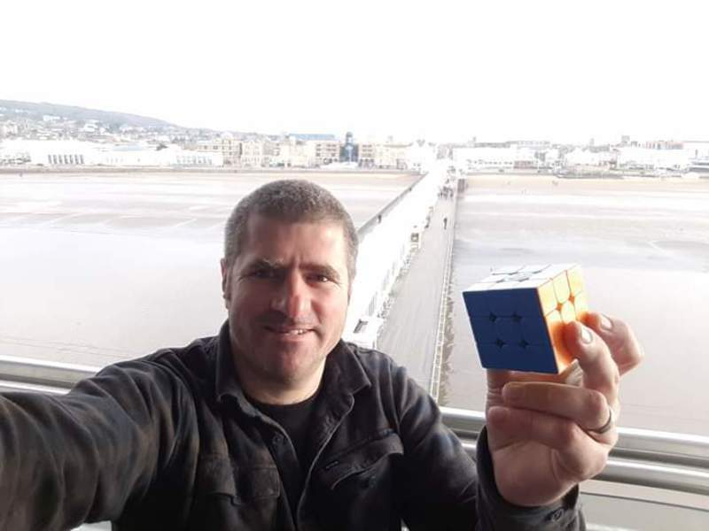

<link rel="stylesheet" type="text/css" href="/scw-comp/css/flags.css" />

## [Senior Cubers Worldwide - Weekly Comp Results](/scw-comp/results/)
### Aaron Cumes - [2018CUME02](https://www.worldcubeassociation.org/persons/2018CUME02)

<i class="flag flag-GB" />&nbsp;United Kingdom

🥇 = 1st senior, 🥈 = 2nd senior, 🥉 = 3rd senior, 💥 = overall record (age group), 🔥 = PR average, ⚡ = PR single.

| Event | Single | Average | Medals | Achievements|
| :-- | --: | --: | :-- | :-- |
| [3x3x3](333.md) | 15.18 | 18.44 | 🥉 x 4 | 🔥 x 9, ⚡ x 6 |
| [2x2x2](222.md) | 3.13 | 6.39 | 🥈 x 3, 🥉 x 2 | 💥 x 1, 🔥 x 8, ⚡ x 7 |
| [4x4x4](444.md) | 1:02.34 | 1:09.72 | 🥈 x 1, 🥉 x 8 | 🔥 x 10, ⚡ x 6 |
| [5x5x5](555.md) | 2:21.64 | 2:32.97 | 🥉 x 3 | 🔥 x 4, ⚡ x 3 |
| [6x6x6](666.md) | 4:49.66 | - | 🥈 x 1, 🥉 x 5 | ⚡ x 4 |
| [7x7x7](777.md) | 7:39.02 | - | 🥇 x 1, 🥈 x 1, 🥉 x 6 | ⚡ x 5 |
| [3x3x3 OH](333oh.md) | 1:01.02 | 1:17.51 |  | 🔥 x 7, ⚡ x 8 |
| [Megaminx](minx.md) | 3:52.70 | - | 🥉 x 4 | ⚡ x 2 |
| [Pyraminx](pyram.md) | 11.80 | 13.95 | 🥈 x 1, 🥉 x 5 | 🔥 x 2, ⚡ x 4 |
| [Skewb](skewb.md) | 14.77 | 18.74 | 🥈 x 4 | 🔥 x 4, ⚡ x 2 |
| [Clock](clock.md) | 26.22 | 32.71 | 🥈 x 1, 🥉 x 1 | 🔥 x 3, ⚡ x 3 |

<!-- Global site tag (gtag.js) - Google Analytics -->

