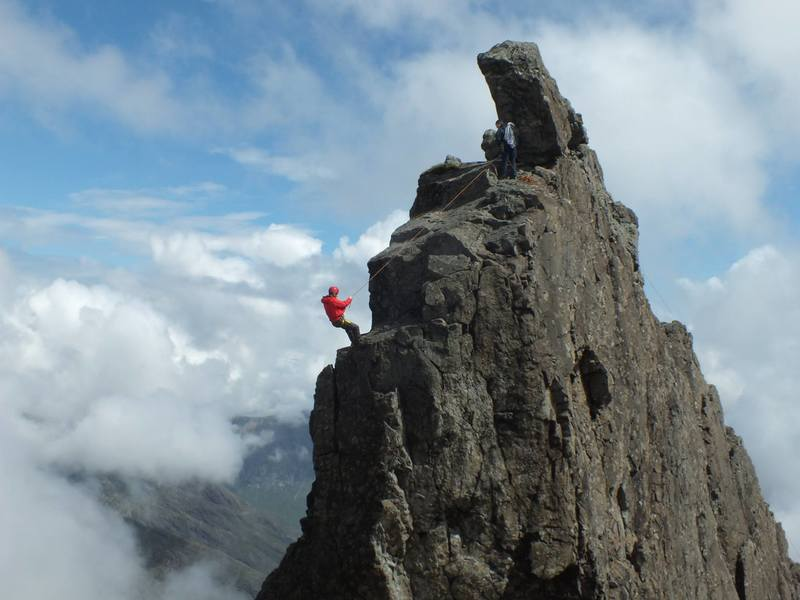

<link rel="stylesheet" type="text/css" href="../../css/flags.css" />

## [Senior Cubers Worldwide - Weekly Comp Results](../../results/)
### [Andy Nicholls](README.md) - [2015NICH04](https://www.worldcubeassociation.org/persons/2015NICH04?event=minx)

<i class="flag flag-GB" />&nbsp;United Kingdom

#### Megaminx Results

🥇 = 1st senior, 🥈 = 2nd senior, 🥉 = 3rd senior, 🔥 = PR average, ⚡ = PR single.

| Date | Age | Single | Average | Awards | Solve 1 | Solve 2 | Solve 3 | Solve 4 | Solve 5 | Video |
| :--: | :--: | --: | --: | :--: | --: | --: | --: | --: | --: | :-- |
| [2020-07-21](../../results/2020-07-21/minx.md) | 40+ | 2:35.89 | **2:38.71** | 🥈 🔥 | 2:35.89 | 2:38.29 | 2:41.96 | DNS | DNS | [Desktop](https://www.facebook.com/events/1842039515939197/permalink/1847689885374160) / [Mobile](https://m.facebook.com/events/1842039515939197?view=permalink&id=1847689885374160) |
| [2020-07-14](../../results/2020-07-14/minx.md) | 40+ | 2:24.00 | 2:43.54 | 🥈 | 3:20.10 | 2:24.00 | 2:26.51 | DNS | DNS | [Desktop](https://www.facebook.com/events/1157754364595802/permalink/1160334564337782) / [Mobile](https://m.facebook.com/events/1157754364595802?view=permalink&id=1160334564337782) |
| [2020-07-07](../../results/2020-07-07/minx.md) | 40+ | 3:00.01 | 3:32.36 | 🥈 | 3:00.01 | 3:07.28 | 4:29.79 | DNS | DNS | [Desktop](https://www.facebook.com/events/271667090769235/permalink/273227393946538) / [Mobile](https://m.facebook.com/events/271667090769235?view=permalink&id=273227393946538) |
| [2020-06-23](../../results/2020-06-23/minx.md) | 40+ | 2:47.63 | 2:58.59 | 🥈 | 2:50.81 | 2:47.63 | 3:17.34 | DNS | DNS | [Desktop](https://www.facebook.com/events/722150235200875/permalink/726569791425586) / [Mobile](https://m.facebook.com/events/722150235200875?view=permalink&id=726569791425586) |
| [2020-06-16](../../results/2020-06-16/minx.md) | 40+ | **2:21.01** | **2:38.82** | 🥈 🔥 ⚡ | 2:54.55 | **2:21.01** | 2:40.89 | DNS | DNS | [Desktop](https://www.facebook.com/events/604103587178706/permalink/606984593557272) / [Mobile](https://m.facebook.com/events/604103587178706?view=permalink&id=606984593557272) |
| [2020-06-09](../../results/2020-06-09/minx.md) | 40+ | **2:27.52** | **2:41.98** | 🥈 🔥 ⚡ | **2:27.52** | 2:50.05 | 2:48.36 | DNS | DNS | [Desktop](https://www.facebook.com/events/903549840109576/permalink/904277553370138) / [Mobile](https://m.facebook.com/events/903549840109576?view=permalink&id=904277553370138) |
| [2020-06-02](../../results/2020-06-02/minx.md) | 40+ | **2:48.09** | **2:57.26** | 🥈 🔥 ⚡ | **2:48.09** | 3:15.37 | 2:48.32 | DNS | DNS | [Desktop](https://www.facebook.com/events/3373950429496747/permalink/3374518846106572) / [Mobile](https://m.facebook.com/events/3373950429496747?view=permalink&id=3374518846106572) |
| [2020-05-26](../../results/2020-05-26/minx.md) | 40+ | **2:50.89** | **3:05.02** | 🥈 🔥 ⚡ | 3:11.77 | **2:50.89** | 3:12.40 | DNS | DNS | [Desktop](https://www.facebook.com/events/688407551989463/permalink/690047708492114) / [Mobile](https://m.facebook.com/events/688407551989463?view=permalink&id=690047708492114) |

<!-- Global site tag (gtag.js) - Google Analytics -->

