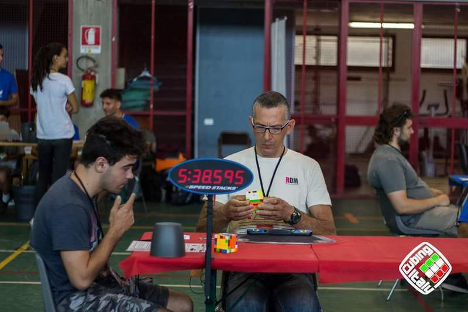

<link rel="stylesheet" type="text/css" href="../css/flags.css" />

## [Senior Cubers Worldwide - Weekly Comp Results](../results/)
### Ciro Vignotto - [2014VIGN02](https://www.worldcubeassociation.org/persons/2014VIGN02)

<i class="flag flag-IT" />&nbsp;Italy

🥇 = 1st senior, 🥈 = 2nd senior, 🥉 = 3rd senior, 💥 = overall record (age group), 🔥 = PR average, ⚡ = PR single.

| Event | Single | Average | Medals | Achievements|
| :-- | --: | --: | :-- | :-- |
| [3x3x3](333.md) | 14.59 | 18.05 | 🥉 x 3 | 🔥 x 2, ⚡ x 3 |
| [2x2x2](222.md) | 3.87 | 5.74 | 🥈 x 3, 🥉 x 1 | 💥 x 1, 🔥 x 4, ⚡ x 3 |
| [4x4x4](444.md) | 56.70 | 1:03.64 | 🥇 x 1, 🥈 x 2, 🥉 x 1 | 🔥 x 4, ⚡ x 1 |
| [5x5x5](555.md) | 2:08.36 | 2:18.73 | 🥈 x 1, 🥉 x 2 | 🔥 x 2, ⚡ x 3 |
| [3x3x3 FMC](333fm.md) | 43 | - | 🥉 x 1 | ⚡ x 1 |

<!-- Global site tag (gtag.js) - Google Analytics -->

