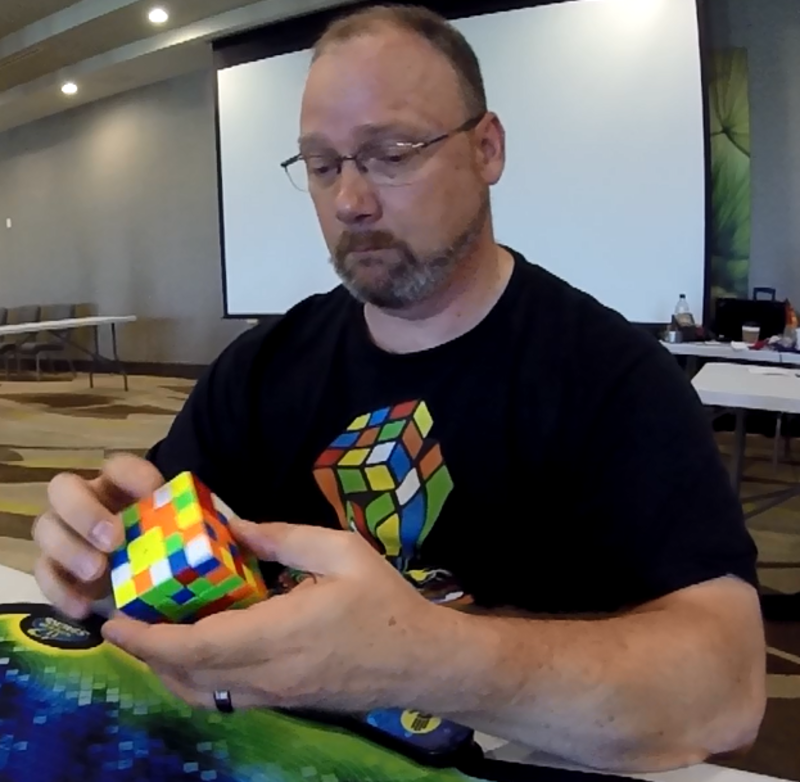

<link rel="stylesheet" type="text/css" href="/scw-comp/css/flags.css" />

## [Senior Cubers Worldwide - Weekly Comp Results](/scw-comp/results/)
### [Daniel Smith](README.md) - [2018SMIT42](https://www.worldcubeassociation.org/persons/2018SMIT42?event=666)

<i class="flag flag-US" />&nbsp;United States

#### 6x6x6 Results

🥇 = 1st senior, 🥈 = 2nd senior, 🥉 = 3rd senior, 💥 = overall record (age group), 🔥 = PR average, ⚡ = PR single.

| Date | Age | Single | Average | Awards | Solve 1 | Solve 2 | Solve 3 | Video |
| :--: | :--: | --: | --: | :--: | --: | --: | --: | :-- |
| [2021-05-03](../../results/2021-05-03/666.md) | 50+ | 5:54.98 | DNF |  | 6:03.43 | 5:54.98 | DNS | [Desktop](https://www.facebook.com/events/158701836186375/permalink/167195022003723) / [Mobile](https://m.facebook.com/events/158701836186375?view=permalink&id=167195022003723) |
| [2020-10-13](../../results/2020-10-13/666.md) | 50+ | 6:20.15 | DNF | 🥉 | 6:27.08 | 6:20.15 | DNS | [Desktop](https://www.facebook.com/events/746942356162446/permalink/751733412350007) / [Mobile](https://m.facebook.com/events/746942356162446?view=permalink&id=751733412350007) |
| [2020-10-06](../../results/2020-10-06/666.md) | 50+ | 6:37.49 | DNF | 🥉 | 7:06.00 | 6:37.49 | DNS | [Desktop](https://www.facebook.com/events/427181104911253/permalink/437238780572152) / [Mobile](https://m.facebook.com/events/427181104911253?view=permalink&id=437238780572152) |
| [2020-05-26](../../results/2020-05-26/666.md) | 50+ | 6:10.54 | DNF |  | 6:10.54 | 6:28.09 | DNS | [Desktop](https://www.facebook.com/events/637852836799991/permalink/641464449772163) / [Mobile](https://m.facebook.com/events/637852836799991?view=permalink&id=641464449772163) |
| [2020-05-19](../../results/2020-05-19/666.md) | 50+ | 5:59.46 | DNF |  | 5:59.46 | 6:04.59 | DNS | [Desktop](https://www.facebook.com/events/201300894172579/permalink/204240630545272) / [Mobile](https://m.facebook.com/events/201300894172579?view=permalink&id=204240630545272) |
| [2020-05-12](../../results/2020-05-12/666.md) | 50+ | 6:15.67 | DNF |  | 6:15.67 | 6:25.37 | DNS | [Desktop](https://www.facebook.com/events/276138643524223/permalink/279838476487573) / [Mobile](https://m.facebook.com/events/276138643524223?view=permalink&id=279838476487573) |
| [2020-05-05](../../results/2020-05-05/666.md) | 50+ | **5:28.23** | **5:54.57** | 🥈 💥 🔥 ⚡ | **5:28.23** | 6:11.67 | 6:03.81 | [Desktop](https://www.facebook.com/events/557526585195168/permalink/562187611395732) / [Mobile](https://m.facebook.com/events/557526585195168?view=permalink&id=562187611395732) |

<!-- Global site tag (gtag.js) - Google Analytics -->

