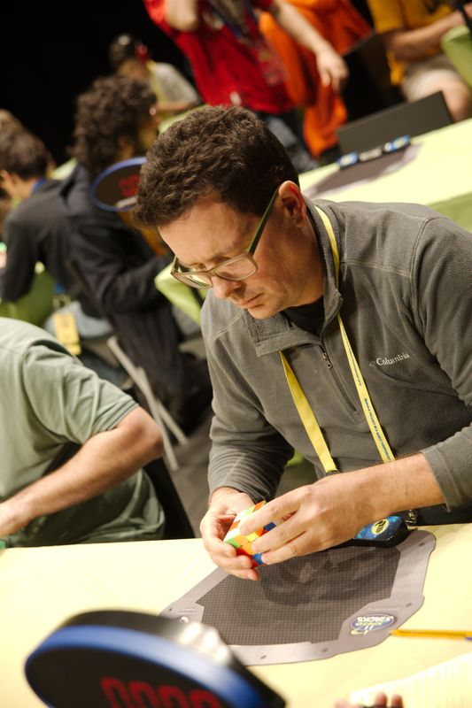

<link rel="stylesheet" type="text/css" href="/scw-comp/css/flags.css" />

## [Senior Cubers Worldwide - Weekly Comp Results](/scw-comp/results/)
### David Roche - [2014ROCH07](https://www.worldcubeassociation.org/persons/2014ROCH07)

<i class="flag flag-AU" />&nbsp;Australia

🏆 = overall winner, 🥇 = 1st senior, 🥈 = 2nd senior, 🥉 = 3rd senior, 💥 = overall record (age group), 🔥 = PR average, ⚡ = PR single.

| Event | Single | Average | Cups | Medals | Achievements|
| :-- | --: | --: | :--: | :-- | :-- |
| [3x3x3 FMC](333fm.md) | 21 | 26.00 | 🏆 x 5 | 🥇 x 9, 🥈 x 5, 🥉 x 4 | 💥 x 7, 🔥 x 4, ⚡ x 4 |

<!-- Global site tag (gtag.js) - Google Analytics -->

