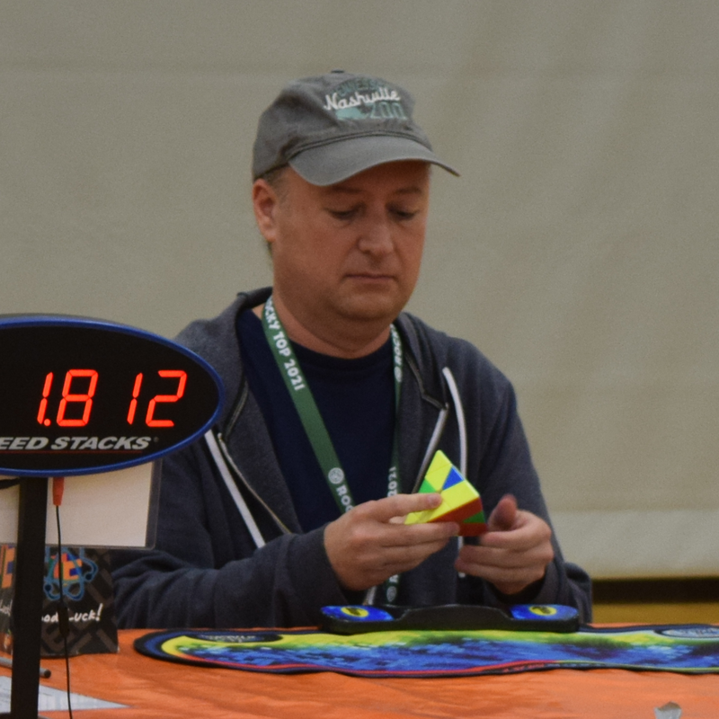

<link rel="stylesheet" type="text/css" href="../../css/flags.css" />

## [Senior Cubers Worldwide - Weekly Comp Results](../../results/)
### [Eric Dodson](README.md) - [2021DODS01](https://www.worldcubeassociation.org/persons/2021DODS01?event=666)

<i class="flag flag-US" />&nbsp;United States

#### 6x6x6 Results

🥇 = 1st senior, 🥈 = 2nd senior, 🥉 = 3rd senior, 🔥 = PR average, ⚡ = PR single.

| Date | Age | Single | Average | Awards | Solve 1 | Solve 2 | Solve 3 | Video |
| :--: | :--: | --: | --: | :--: | --: | --: | --: | :-- |
| [2024-09-16](../../results/2024-09-16/666.md) | 50+ | **5:21.85** | DNF | ⚡ | 5:22.59 | **5:21.85** | DNS | [Desktop](https://www.facebook.com/events/1169142974162460/permalink/1171316953945062) / [Mobile](https://m.facebook.com/events/1169142974162460?view=permalink&id=1171316953945062) |
| [2022-04-04](../../results/2022-04-04/666.md) | 40+ | **8:34.62** | DNF | 🥈 ⚡ | **8:34.62** | DNS | DNS | [Desktop](https://www.facebook.com/events/405703218032158/permalink/413892857213194) / [Mobile](https://m.facebook.com/events/405703218032158?view=permalink&id=413892857213194) |

<!-- Global site tag (gtag.js) - Google Analytics -->

