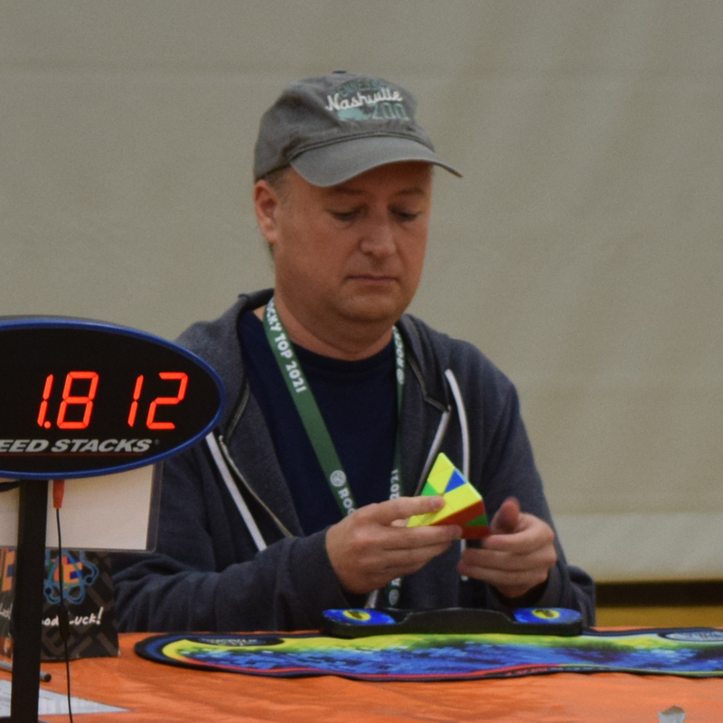

<link rel="stylesheet" type="text/css" href="../../css/flags.css" />

## [Senior Cubers Worldwide - Weekly Comp Results](../../results/)
### Eric Dodson - [2021DODS01](https://www.worldcubeassociation.org/persons/2021DODS01)

<i class="flag flag-US" />&nbsp;United States

🏆 = overall winner, 🥇 = 1st senior, 🥈 = 2nd senior, 🥉 = 3rd senior, 🔥 = PR average, ⚡ = PR single.

| Event | Single | Average | Cups | Medals | Achievements|
| :-- | --: | --: | :--: | :-- | :-- |
| [3x3x3](333.md) | 20.25 | 26.27 |  |  | 🔥 x 7, ⚡ x 7 |
| [2x2x2](222.md) | 6.10 | 7.57 | 🏆 x 2 | 🥇 x 2, 🥈 x 1, 🥉 x 5 | 🔥 x 8, ⚡ x 11 |
| [4x4x4](444.md) | 1:22.70 | 1:37.04 |  | 🥉 x 1 | 🔥 x 4, ⚡ x 5 |
| [5x5x5](555.md) | 2:50.88 | 2:57.27 |  | 🥉 x 2 | 🔥 x 3, ⚡ x 2 |
| [6x6x6](666.md) | 5:21.85 | - |  | 🥈 x 1 | ⚡ x 2 |
| [7x7x7](777.md) | 8:03.49 | - |  | 🥉 x 1 | ⚡ x 2 |
| [3x3x3 OH](333oh.md) | 44.71 | 1:05.04 |  | 🥈 x 1, 🥉 x 2 | 🔥 x 2, ⚡ x 3 |
| [Megaminx](minx.md) | 2:27.35 | 2:49.50 |  | 🥈 x 1, 🥉 x 1 | 🔥 x 2, ⚡ x 3 |
| [Pyraminx](pyram.md) | 6.34 | 10.82 |  | 🥇 x 1, 🥈 x 4, 🥉 x 6 | 🔥 x 11, ⚡ x 8 |
| [Skewb](skewb.md) | 4.34 | 8.51 | 🏆 x 11 | 🥇 x 13, 🥈 x 5, 🥉 x 3 | 🔥 x 8, ⚡ x 8 |
| [Square-1](sq1.md) | 24.63 | 36.77 |  | 🥈 x 1, 🥉 x 7 | 🔥 x 6, ⚡ x 6 |
| [Clock](clock.md) | 8.81 | 9.86 | 🏆 x 6 | 🥇 x 6, 🥈 x 3, 🥉 x 3 | 🔥 x 8, ⚡ x 6 |
| [3x3x3 BLD](333bf.md) | 3:41.00 | - |  | 🥉 x 1 | ⚡ x 1 |
| [3x3x3 FMC](333fm.md) | 48 | 52.67 |  |  | 🔥 x 1, ⚡ x 1 |

<!-- Global site tag (gtag.js) - Google Analytics -->

