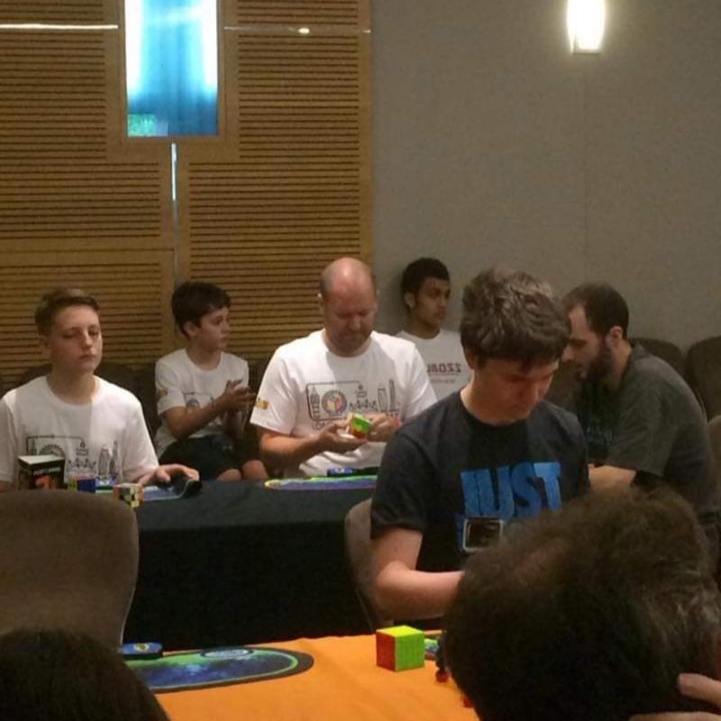

<link rel="stylesheet" type="text/css" href="../css/flags.css" />

## [Senior Cubers Worldwide - Weekly Comp Results](../results/)
### [Geoff Hartnell](README.md) - [2017HART06](https://www.worldcubeassociation.org/persons/2017HART06?event=pyram)

<i class="flag flag-GB" />&nbsp;United Kingdom

#### Pyraminx Results

🔥 = PR average, ⚡ = PR single.

| Date | Age | Single | Average | Awards | Solve 1 | Solve 2 | Solve 3 | Solve 4 | Solve 5 | Video |
| :--: | :--: | --: | --: | :--: | --: | --: | --: | --: | --: | :-- |
| [2020-06-16](../../results/2020-06-16/pyram.md) | 40+ | **19.74** | **24.12** | 🔥 ⚡ | **19.74** | 52.89 | 22.43 | 21.95 | 27.97 | [Desktop](https://www.facebook.com/events/296087658445428/permalink/296203821767145) / [Mobile](https://m.facebook.com/events/296087658445428?view=permalink&id=296203821767145) |

<!-- Global site tag (gtag.js) - Google Analytics -->

