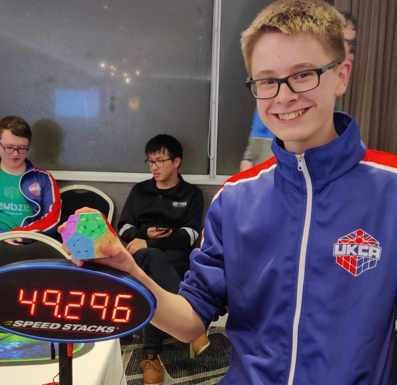

<link rel="stylesheet" type="text/css" href="../css/flags.css" />

## [Senior Cubers Worldwide - Weekly Comp Results](../../results/)
### Jaidon Adams - [2018ADAM11](https://www.worldcubeassociation.org/persons/2018ADAM11)

<i class="flag flag-GB" />&nbsp;United Kingdom

🏆 = overall winner, 💥 = overall record (age group), 🔥 = PR average, ⚡ = PR single.

| Event | Single | Average | Cups | Achievements|
| :-- | --: | --: | :--: | :-- |
| [3x3x3](333.md) | 8.31 | 8.67 | 🏆 x 2 | 💥 x 1, 🔥 x 1, ⚡ x 1 |
| [2x2x2](222.md) | 2.45 | 3.10 | 🏆 x 1 | 💥 x 1, 🔥 x 1, ⚡ x 1 |

<!-- Global site tag (gtag.js) - Google Analytics -->

