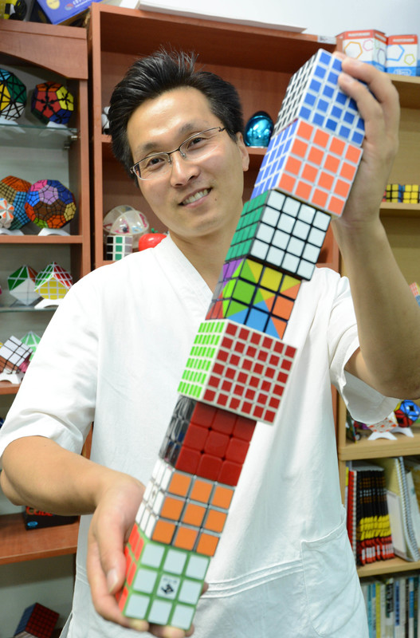

<link rel="stylesheet" type="text/css" href="../css/flags.css" />

## [Senior Cubers Worldwide - Weekly Comp Results](../../results/)
### Jang Junho (장준호) - [2014JUNH01](https://www.worldcubeassociation.org/persons/2014JUNH01)

<i class="flag flag-KR" />&nbsp;Republic of Korea

🔥 = PR average, ⚡ = PR single.

| Event | Single | Average | Achievements|
| :-- | --: | --: | :-- |
| [3x3x3](333.md) | 20.33 | 25.66 | 🔥 x 4, ⚡ x 2 |
| [2x2x2](222.md) | 9.01 | 10.40 | 🔥 x 2, ⚡ x 3 |
| [4x4x4](444.md) | 2:31.31 | 2:58.70 | 🔥 x 1, ⚡ x 1 |
| [3x3x3 OH](333oh.md) | 59.25 | 1:06.79 | 🔥 x 3, ⚡ x 3 |

<!-- Global site tag (gtag.js) - Google Analytics -->

