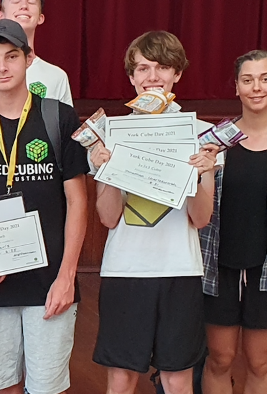

<link rel="stylesheet" type="text/css" href="../css/flags.css" />

## [Senior Cubers Worldwide - Weekly Comp Results](../../results/)
### [Jonathan Charlesworth](README.md) - [2016CHAR01](https://www.worldcubeassociation.org/persons/2016CHAR01?event=333)

<i class="flag flag-AU" />&nbsp;Australia

#### 3x3x3 Results

🏆 = overall winner, 🔥 = PR average, ⚡ = PR single.

| Date | Age | Single | Average | Awards | Solve 1 | Solve 2 | Solve 3 | Solve 4 | Solve 5 | Video |
| :--: | :--: | --: | --: | :--: | --: | --: | --: | --: | --: | :-- |
| [2020-05-26](../../results/2020-05-26/333.md) | <20 | **9.13** | **10.26** | 🏆 🔥 ⚡ | 9.65 | 10.65 | 11.81 | **9.13** | 10.48 | [Desktop](https://www.facebook.com/events/688407551989463/permalink/690761785087373) / [Mobile](https://m.facebook.com/events/688407551989463?view=permalink&id=690761785087373) |

<!-- Global site tag (gtag.js) - Google Analytics -->

