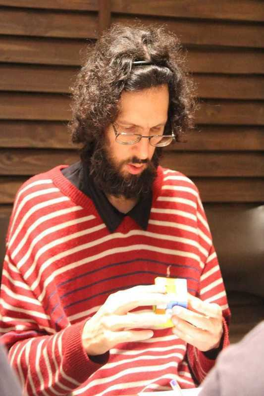

<link rel="stylesheet" type="text/css" href="/scw-comp/css/flags.css" />

## [Senior Cubers Worldwide - Weekly Comp Results](/scw-comp/results/)
### [Marius Rombout Ferreira van Riemsdijk](README.md) - [2014RIEM01](https://www.worldcubeassociation.org/persons/2014RIEM01?event=333fm)

<i class="flag flag-BR" />&nbsp;Brazil

#### 3x3x3 Fewest Moves Results

🆠= overall winner, 🥇 = 1st senior, 🥈 = 2nd senior, 🥉 = 3rd senior, 🔥 = PR average, ⚡ = PR single.

| Date | Age | Single | Average | Awards | Solve 1 | Solve 2 | Solve 3 | Solution |
| :--: | :--: | :--: | :--: | :--: | --: | --: | --: | :-- |
| [2022-10-17](../../results/2022-10-17/333fm.md) | 40+ | 30 | DNF | 🥈 | 30 | 30 | DNF | [Desktop](https://www.facebook.com/events/1155993541977926/permalink/1156850481892232) / [Mobile](https://m.facebook.com/events/1155993541977926?view=permalink&id=1156850481892232) |
| [2022-10-03](../../results/2022-10-03/333fm.md) | 40+ | 32 | DNF | 🥈 | 34 | DNF | 32 | [Desktop](https://www.facebook.com/events/3169232626723149/permalink/3182940292019049) / [Mobile](https://m.facebook.com/events/3169232626723149?view=permalink&id=3182940292019049) |
| [2022-09-19](../../results/2022-09-19/333fm.md) | 40+ | 29 | 33.33 | 🥈 | 36 | 35 | 29 | [Desktop](https://www.facebook.com/events/3238372606482352/permalink/3239464103039869) / [Mobile](https://m.facebook.com/events/3238372606482352?view=permalink&id=3239464103039869) |
| [2022-09-05](../../results/2022-09-05/333fm.md) | 40+ | 31 | 34.00 | 🏆 🥇 | 31 | 35 | 36 | [Desktop](https://www.facebook.com/events/600763575022561/permalink/601902394908679) / [Mobile](https://m.facebook.com/events/600763575022561?view=permalink&id=601902394908679) |
| [2022-08-22](../../results/2022-08-22/333fm.md) | 40+ | 33 | 33.67 | 🥈 | 33 | 35 | 33 | [Desktop](https://www.facebook.com/events/758758925188582/permalink/759896905074784) / [Mobile](https://m.facebook.com/events/758758925188582?view=permalink&id=759896905074784) |
| [2022-08-08](../../results/2022-08-08/333fm.md) | 40+ | **28** | 32.00 | 🏆 🥇 ⚡ | 32 | **28** | 36 | [Desktop](https://www.facebook.com/events/743432360264158/permalink/748269176447143) / [Mobile](https://m.facebook.com/events/743432360264158?view=permalink&id=748269176447143) |
| [2021-08-23](../../results/2021-08-23/333fm.md) | 40+ | **29** | **30.67** | 🏆 🥇 🔥 ⚡ | 30 | 33 | **29** | [Desktop](https://www.facebook.com/events/367378891664957/permalink/373345437734969) / [Mobile](https://m.facebook.com/events/367378891664957?view=permalink&id=373345437734969) |
| [2021-02-09](../../results/2021-02-09/333fm.md) | 40+ | **29** | - | 🥉 ⚡ | - | - | - | [Desktop](https://www.facebook.com/events/324362745652604/permalink/325260145562864) / [Mobile](https://m.facebook.com/events/324362745652604?view=permalink&id=325260145562864) |
| [2021-02-02](../../results/2021-02-02/333fm.md) | 40+ | **32** | - | 🥈 ⚡ | - | - | - | [Desktop](https://www.facebook.com/events/117342666946735/permalink/121218783225790) / [Mobile](https://m.facebook.com/events/117342666946735?view=permalink&id=121218783225790) |

<!-- Global site tag (gtag.js) - Google Analytics -->

