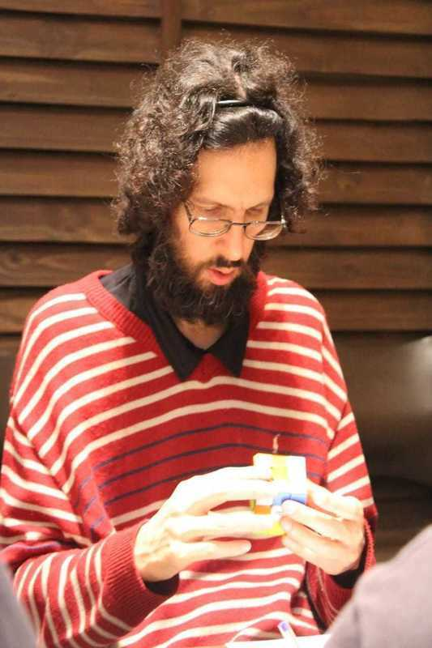

<link rel="stylesheet" type="text/css" href="../../css/flags.css" />

## [Senior Cubers Worldwide - Weekly Comp Results](../../results/)
### Marius Rombout Ferreira van Riemsdijk - [2014RIEM01](https://www.worldcubeassociation.org/persons/2014RIEM01)

<i class="flag flag-BR" />&nbsp;Brazil

🏆 = overall winner, 🥇 = 1st senior, 🥈 = 2nd senior, 🥉 = 3rd senior, 🔥 = PR average, ⚡ = PR single.

| Event | Single | Average | Cups | Medals | Achievements|
| :-- | --: | --: | :--: | :-- | :-- |
| [3x3x3 FMC](333fm.md) | 24 | 28.67 | 🏆 x 33 | 🥇 x 37, 🥈 x 11, 🥉 x 1 | 🔥 x 5, ⚡ x 9 |

<!-- Global site tag (gtag.js) - Google Analytics -->

