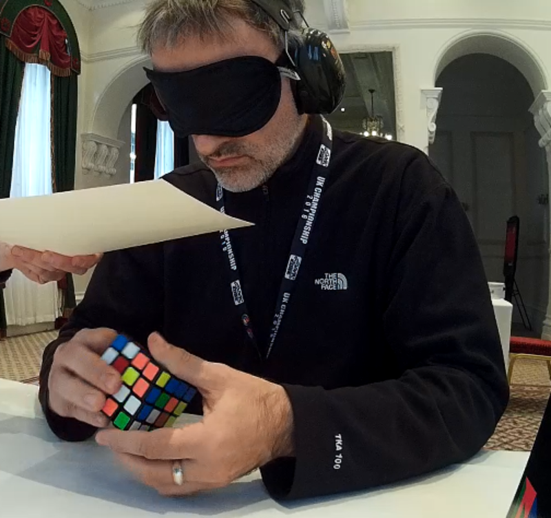

<link rel="stylesheet" type="text/css" href="../css/flags.css" />

## [Senior Cubers Worldwide - Weekly Comp Results](../../results/)
### Mark Rivers - [2015RIVE05](https://www.worldcubeassociation.org/persons/2015RIVE05)

<i class="flag flag-GB" />&nbsp;United Kingdom

🆠= overall winner, 🥇 = 1st senior, 🥈 = 2nd senior, 🥉 = 3rd senior, 🔥 = PR average, ⚡ = PR single.

| Event | Single | Average | Cups | Medals | Achievements|
| :-- | --: | --: | :--: | :-- | :-- |
| [3x3x3 FMC](333fm.md) | 32 | - | 🏆 x 1 | 🥇 x 1, 🥈 x 3, 🥉 x 3 | ⚡ x 3 |

<!-- Global site tag (gtag.js) - Google Analytics -->

