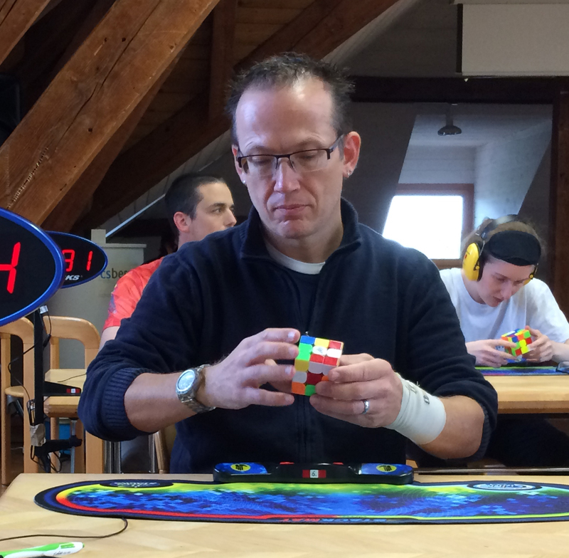

<link rel="stylesheet" type="text/css" href="../css/flags.css" />

## [Senior Cubers Worldwide - Weekly Comp Results](../results/)
### [Markus Niederöst](README.md) - [2018NIED02](https://www.worldcubeassociation.org/persons/2018NIED02?event=222)

<i class="flag flag-CH" />&nbsp;Switzerland

#### 2x2x2 Results

🔥 = PR average, ⚡ = PR single.

| Date | Age | Single | Average | Awards | Solve 1 | Solve 2 | Solve 3 | Solve 4 | Solve 5 | Video |
| :--: | :--: | --: | --: | :--: | --: | --: | --: | --: | --: | :-- |
| [2020-06-16](../../results/2020-06-16/222.md) | 50+ | **7.80** | **9.63** | 🔥 ⚡ | **7.80** | 20.30 | 10.73 | 8.39 | 9.78 | [Desktop](https://www.facebook.com/events/604103587178706/permalink/608554836733581) / [Mobile](https://m.facebook.com/events/604103587178706?view=permalink&id=608554836733581) |

<!-- Global site tag (gtag.js) - Google Analytics -->

