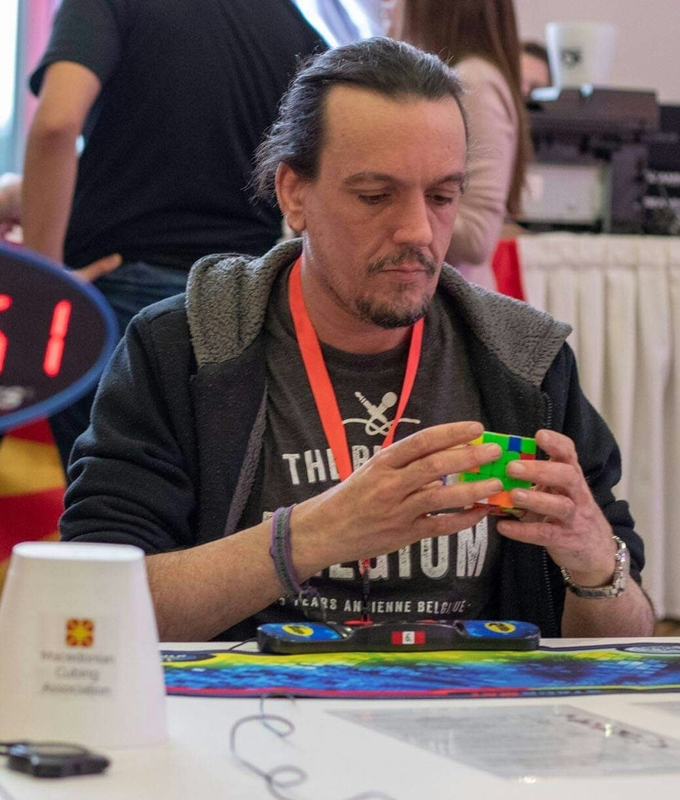

<link rel="stylesheet" type="text/css" href="../css/flags.css" />

## [Senior Cubers Worldwide - Weekly Comp Results](../../results/)
### Neilimixam Snetrem - [2018MERT01](https://www.worldcubeassociation.org/persons/2018MERT01)

<i class="flag flag-BE" />&nbsp;Belgium

🔥 = PR average, ⚡ = PR single.

| Event | Single | Average | Achievements|
| :-- | --: | --: | :-- |
| [3x3x3](333.md) | 14.32 | 20.01 | 🔥 x 1, ⚡ x 1 |
| [4x4x4](444.md) | 1:08.70 | 1:24.75 | 🔥 x 1, ⚡ x 1 |

<!-- Global site tag (gtag.js) - Google Analytics -->

