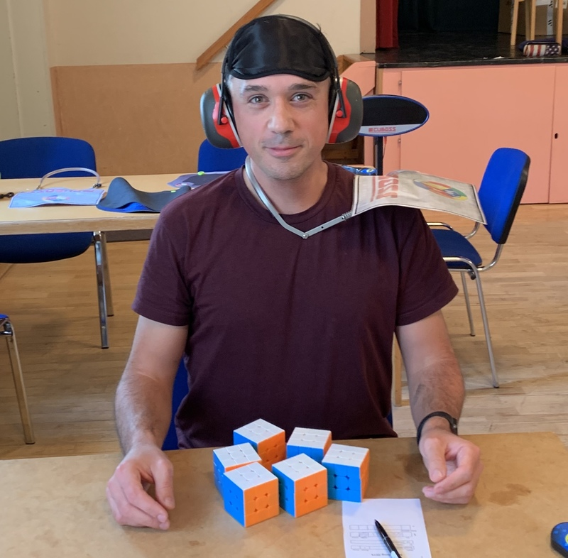

<link rel="stylesheet" type="text/css" href="/scw-comp/css/flags.css" />

## [Senior Cubers Worldwide - Weekly Comp Results](/scw-comp/results/)
### [Pontus Uggla](README.md) - [2014UGGL01](https://www.worldcubeassociation.org/persons/2014UGGL01?event=333)

<i class="flag flag-SE" />&nbsp;Sweden

#### 3x3x3 Results

🔥 = PR average, ⚡ = PR single.

| Date | Age | Single | Average | Awards | Solve 1 | Solve 2 | Solve 3 | Video |
| :--: | :--: | --: | --: | :--: | --: | --: | --: | :-- |
| [2020-01-28](../../results/2020-01-28/333.md) | 40+ | **18.25** | **20.09** | 🔥 ⚡ | **18.25** | 18.99 | 23.04 | [Desktop](https://www.facebook.com/pontusuggla/videos/10156642116836576) / [Mobile](https://m.facebook.com/pontusuggla/videos/10156642116836576) |

<!-- Global site tag (gtag.js) - Google Analytics -->

