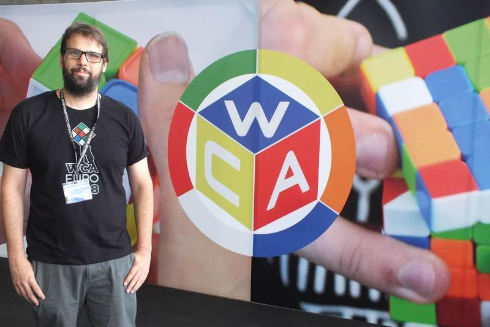

<link rel="stylesheet" type="text/css" href="../../css/flags.css" />

## [Senior Cubers Worldwide - Weekly Comp Results](../../results/)
### [Raúl Morales](README.md) - [2013MORA02](https://www.worldcubeassociation.org/persons/2013MORA02?event=333)

<i class="flag flag-ES" />&nbsp;Spain

#### 3x3x3 Results

🔥 = PR average, ⚡ = PR single.

| Date | Age | Single | Average | Awards | Solve 1 | Solve 2 | Solve 3 | Solve 4 | Solve 5 | Video |
| :--: | :--: | --: | --: | :--: | --: | --: | --: | --: | --: | :-- |
| [2020-02-18](../../results/2020-02-18/333.md) | 40+ | **15.73** | **19.60** | 🔥 ⚡ | 17.69 | 20.21 | **15.73** | 20.89 | 21.97 | |

<!-- Global site tag (gtag.js) - Google Analytics -->

