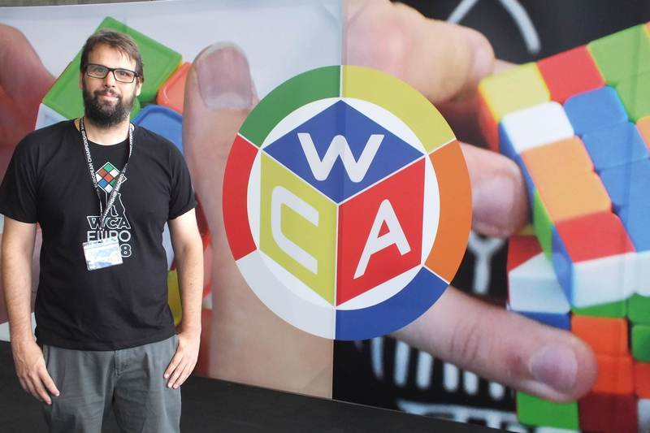

<link rel="stylesheet" type="text/css" href="../../css/flags.css" />

## [Senior Cubers Worldwide - Weekly Comp Results](../../results/)
### Raúl Morales - [2013MORA02](https://www.worldcubeassociation.org/persons/2013MORA02)

<i class="flag flag-ES" />&nbsp;Spain

🔥 = PR average, ⚡ = PR single.

| Event | Single | Average | Achievements|
| :-- | --: | --: | :-- |
| [3x3x3](333.md) | 15.73 | 19.60 | 🔥 x 1, ⚡ x 1 |
| [5x5x5](555.md) | 2:17.13 | 2:27.99 | 🔥 x 1, ⚡ x 1 |
| [3x3x3 OH](333oh.md) | 31.07 | 37.84 | 🔥 x 1, ⚡ x 1 |

<!-- Global site tag (gtag.js) - Google Analytics -->

