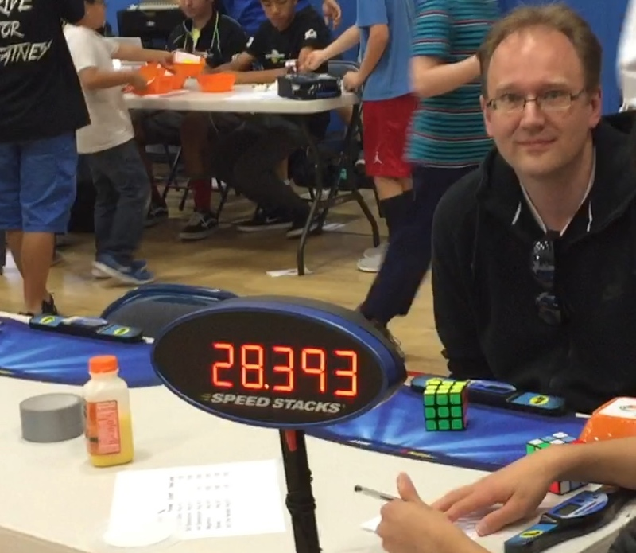

<link rel="stylesheet" type="text/css" href="../css/flags.css" />

## [Senior Cubers Worldwide - Weekly Comp Results](../results/)
### Rob Peters - [2016PETE06](https://www.worldcubeassociation.org/persons/2016PETE06)

<i class="flag flag-US" />&nbsp;United States

🥇 = 1st senior, 🥈 = 2nd senior, 🥉 = 3rd senior, 🔥 = PR average, ⚡ = PR single.

| Event | Single | Average | Medals | Achievements|
| :-- | --: | --: | :-- | :-- |
| [3x3x3](333.md) | 15.00 | 16.58 | 🥈 x 2, 🥉 x 1 | 🔥 x 3, ⚡ x 3 |
| [4x4x4](444.md) | 53.64 | 1:01.01 | 🥈 x 4, 🥉 x 1 | 🔥 x 3, ⚡ x 2 |

<!-- Global site tag (gtag.js) - Google Analytics -->

