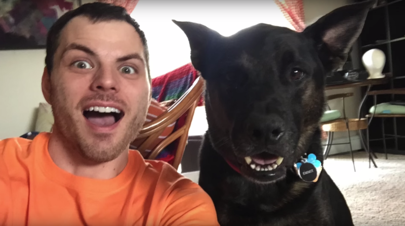

<link rel="stylesheet" type="text/css" href="../../css/flags.css" />

## [Senior Cubers Worldwide - Weekly Comp Results](../../results/)
### Shawn Boucké - [2016BOUC01](https://www.worldcubeassociation.org/persons/2016BOUC01)

<i class="flag flag-US" />&nbsp;United States

🏆 = overall winner, 💥 = overall record (age group), 🔥 = PR average, ⚡ = PR single.

| Event | Single | Average | Cups | Achievements|
| :-- | --: | --: | :--: | :-- |
| [3x3x3](333.md) | 8.54 | 11.60 | 🏆 x 18 | 💥 x 2, 🔥 x 5, ⚡ x 3 |
| [2x2x2](222.md) | 2.29 | 3.52 | 🏆 x 12 | 🔥 x 4, ⚡ x 7 |
| [4x4x4](444.md) | 43.27 | 49.26 | 🏆 x 24 | 💥 x 2, 🔥 x 3, ⚡ x 7 |
| [5x5x5](555.md) | 2:05.29 | 2:20.52 |  | 🔥 x 1, ⚡ x 1 |
| [3x3x3 OH](333oh.md) | 23.99 | 27.70 | 🏆 x 1 | 🔥 x 1, ⚡ x 2 |
| [3x3x3 FMC](333fm.md) | 23 | 24.67 | 🏆 x 42 | 💥 x 1, 🔥 x 9, ⚡ x 9 |

<!-- Global site tag (gtag.js) - Google Analytics -->

