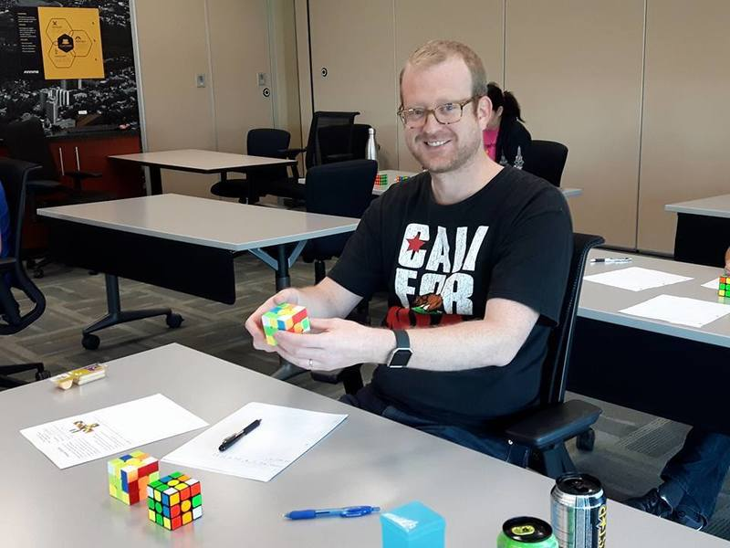

<link rel="stylesheet" type="text/css" href="/scw-comp/css/flags.css" />

## [Senior Cubers Worldwide - Weekly Comp Results](/scw-comp/results/)
### [Timothy Babb](README.md) - [2015BABB01](https://www.worldcubeassociation.org/persons/2015BABB01?event=333oh)

<i class="flag flag-CA" />&nbsp;Canada

#### 3x3x3 One-Handed Results

🔥 = PR average, ⚡ = PR single.

| Date | Age | Single | Average | Awards | Solve 1 | Solve 2 | Solve 3 | Solve 4 | Solve 5 | Video |
| :--: | :--: | --: | --: | :--: | --: | --: | --: | --: | --: | :-- |
| [2020-08-25](../../results/2020-08-25/333oh.md) | <30 | **40.64** | **44.13** | 🔥 ⚡ | 56.14 | 42.05 | 49.11 | **40.64** | 41.22 | [Desktop](https://www.facebook.com/tbabb/videos/10164454946925553) / [Mobile](https://m.facebook.com/tbabb/videos/10164454946925553) |

<!-- Global site tag (gtag.js) - Google Analytics -->

