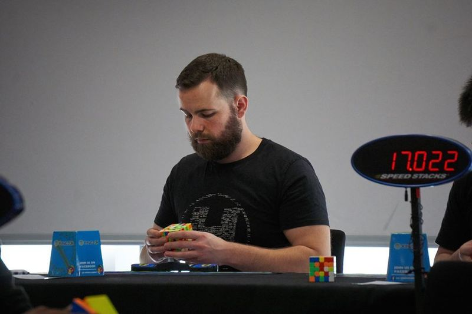

<link rel="stylesheet" type="text/css" href="../css/flags.css" />

## [Senior Cubers Worldwide - Weekly Comp Results](../results/)
### [Tom Doolinski](README.md) - [2008DOOL01](https://www.worldcubeassociation.org/persons/2008DOOL01?event=333)

<i class="flag flag-GB" />&nbsp;United Kingdom

#### 3x3x3 Results

💥 = overall record (age group), 🔥 = PR average, ⚡ = PR single.

| Date | Age | Single | Average | Awards | Solve 1 | Solve 2 | Solve 3 | Video |
| :--: | :--: | --: | --: | :--: | --: | --: | --: | :-- |
| [2020-01-28](../../results/2020-01-28/333.md) | <30 | **13.48** | **14.99** | 💥 🔥 ⚡ | 16.47 | **13.48** | 15.03 | [Desktop](https://www.facebook.com/tom.dooley.35175/videos/1479385075550710) / [Mobile](https://m.facebook.com/tom.dooley.35175/videos/1479385075550710) |

<!-- Global site tag (gtag.js) - Google Analytics -->

