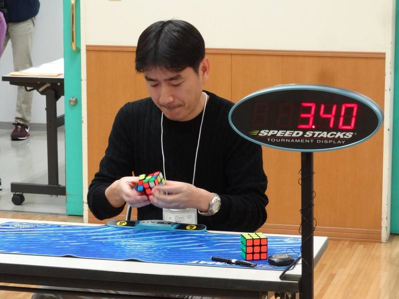

<link rel="stylesheet" type="text/css" href="/scw-comp/css/flags.css" />

## [Senior Cubers Worldwide - Weekly Comp Results](/scw-comp/results/)
### [Yuichi Hamada](README.md) - [2012HAMA02](https://www.worldcubeassociation.org/persons/2012HAMA02?event=555bf)

<i class="flag flag-JP" />&nbsp;Japan

#### 5x5x5 Blindfolded Results

🔥 = PR average, ⚡ = PR single.

| Date | Age | Single | Average | Awards | Solve 1 | Solve 2 | Solve 3 | Video |
| :--: | :--: | --: | --: | :--: | --: | --: | --: | :-- |
| [2021-07-12](../../results/2021-07-12/555bf.md) | 40+ | DNF | DNF |  | DNF | DNF | DNF | [Desktop](https://www.facebook.com/events/360990112107566/permalink/369426457930598) / [Mobile](https://m.facebook.com/events/360990112107566?view=permalink&id=369426457930598) |
| [2021-05-31](../../results/2021-05-31/555bf.md) | 40+ | DNF | DNF |  | DNF | DNF | DNF | [Desktop](https://www.facebook.com/1849183990/videos/10215479041889738) / [Mobile](https://m.facebook.com/1849183990/videos/10215479041889738) |

<!-- Global site tag (gtag.js) - Google Analytics -->

